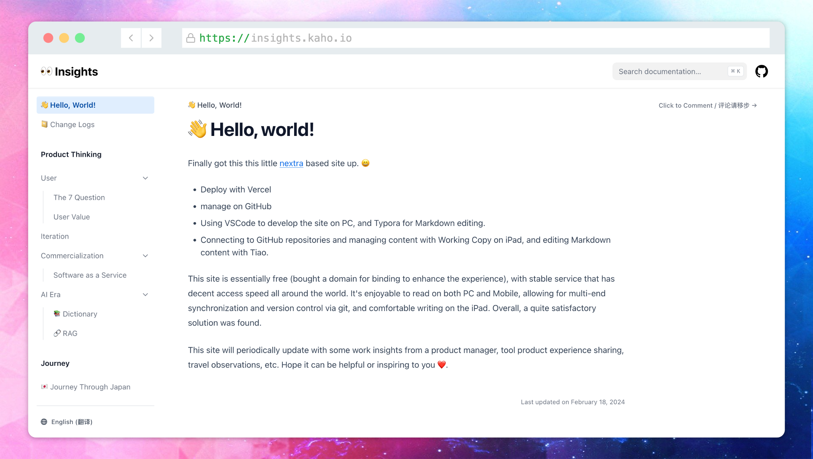

# 👀 Insights

一个关于 AI、产品设计、旅行的杂谈博客。

👉 [点击访问](https://insights.kaho.io)

* 基于 [nextra](https://nextra.site)
* 利用 Vercel 部署
* 利用 GitHub 托管
* 在 PC 端利用 VSCode 对站点进行开发，利用 Typora 进行 Markdown 内容编辑
* 在 iPad 端利用 Working Copy 与 GitHub 仓库连接并进行内容管理，利用 Tiao 进行 Markdown 内容编辑

方案基本免费（为了体验购买了一个域名做绑定），服务稳定，在国内外都有不错的访问速度，PC/Mobile 上都可以愉快阅读，可以利用 git 实现多端同步和版本管理，可以利用 iPad 来写愉快写文，总体上找到了一个比较满意的解决方案。

小站会不定期更新一些产品经理的工作心得、工具产品体验分享、旅游见闻等。希望能对你有帮助或启发 ❤️

--

This is a casual blog about AI, product design, and travel.

👉 [Visit the blog](https://insights.kaho.io)

* Built with [nextra](https://nextra.site)
* Deployed via Vercel
* Hosted on GitHub
* On PC, site development is done with VSCode, and Markdown content is edited with Typora
* On iPad, Working Copy is used to connect with the GitHub repository for content management, and Tiao is used for Markdown editing

The solution is basically free (I bought a domain for a better experience), stable in service, and offers good access speed both domestically and internationally. It’s enjoyable to read on both PC and mobile. With git, multi-device synchronization and version management are possible. Writing on iPad is also a pleasure. Overall, I’ve found a solution I’m quite satisfied with.

This site will be updated from time to time with insights from a product manager’s work, tool/product experience sharing, travel stories, and more. I hope it can be helpful or inspiring to you ❤️

